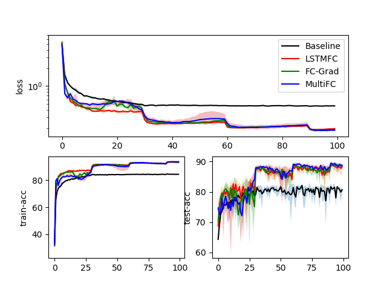
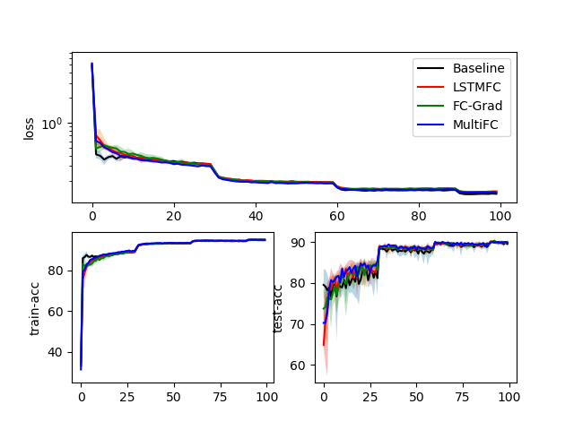
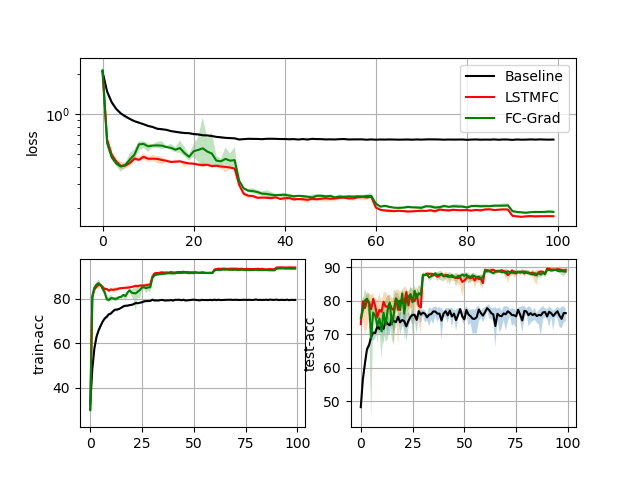
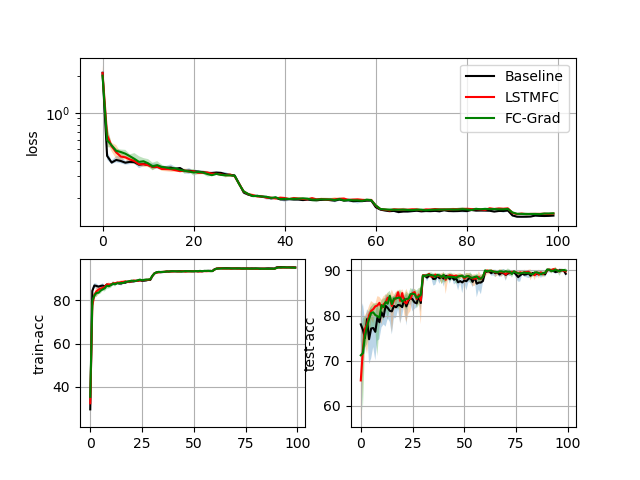

# MetaQuant
Codes for Accepted Paper : "MetaQuant: Learning to Quantize by Learning to Penetrate Non-differentiable Quantization" in NeurIPS 2019.

Camera-ready is now released [here](./MetaQuant-Preprint.pdf)!

Poster is released [here](./MetaQuant-Poster.pdf)!

Slides is released [here](./MetaQuant-Slides)!

## About MetaQuant
check ```meta-quantize-tutorial.ipynb``` for description.

## How to use it

### Prepare pre-trained model
Please check [here](https://github.com/csyhhu/Awesome-Deep-Neural-Network-Compression/tree/master/Codes/TTQ).

The following command train a ResNet20 using CIFAR10:

```python train_base_model.py -m ResNet20 -d CIFAR10```

Or users can use the default pretrained model provided by us. Uploaded in ```Results/model-dataset/model-dataset-pretrain.pth``` 
### Run MetaQuant
The following commands run MetaQuant on ResNet20 using CIFAR10 dataset with dorefa as forward
quantization method and SGD as optimization. 

The resulting quantized model is quantized using 1 bits: {+1, -1} for 
all layers (conv, fc). 

Initial learning rate is set as 1e-3 and decreases by a factor of 0.1 every
30 epochs: 1e-3->1e-4->1e-5:
```python3
CUDA_VISIBLE_DEVICES='0' python meta-quantize.py -m ResNet20 -d CIFAR10 -q dorefa -bw 1 -o SGD -meta MultiFC -hidden 100 -ad 30
```

## Experiments

| Model | Dataset | Forward | Backward | Optimizer | Best Acc | Last 10 Acc | FP Acc |
| :---: |:------: |:------: |:-------: |:--------: |:-------: |:----------: |:-----: |
| ResNet20 | CIFAR10 | dorefa | STE | SGD | 82.704(0.044) | 80.745(2.113) | 91.5 |
| | | | MultiFC | | 89.666(0.06) | 88.942(0.466) |
| | | | FC-Grad | |89.618(0.007) | 88.840(0.291) |
| | | | LSTMFC  | | 89.278(0.09) | 88.305(0.81)  |
| | | | STE | Adam | 90.222(0.014) | 89.782(0.172) |
| | | | MultiFC | | 90.308(0.012) | 89.941(0.068) |
| | | | FC-Grad | |90.407(0.02) | 89.979(0.103) |
| | | | LSTMFC  | | 90.310(0.011) | 89.962(0.068)  |
| | | BWN | STE | SGD | 78.550(0.035) | 75.913(3.495) |
| | | | FC-Grad | |89.500(0.008) | 88.949(0.231) |
| | | | LSTMFC  | | 89.890(0.018) | 89.289(0.212)  |
| | | | STE | Adam | 90.470(0.004) | 89.896(0.182) |
| | | | FC-Grad | | 90.426(0.042) | 90.036(0.109) |
| | | | LSTMFC  | | 90.494(0.030) | 90.042(0.098) |

Best accuracy refers to the best test accuracy recorded during training, mean and variance (in parentheses)
for 5 times experiments are reported. 

Last 10 acc refers to the test accuracy in the last 10 epochs for 5 times
experiments

Raw experimental data can be found in ```Results/model-dataset/runs-Quant-Multiple```
### Comparison using dorefa as forward and SGD as optimizer

### Comparison using dorefa as forward and Adam as optimizer

### Comparison using BWN as forward and SGD as optimizer

### Comparison using BWN as forward and Adam as optimizer


Shadow around line is the max/min value during the multiple trial experiments.
## Required
pytorch > 0.4

## Customization
For using MetaQuant in your own model, the following steps are required:
1. Replace all quantized layer with ```meta_utils.meta_quantized_module.MetaConv``` and ```meta_utils.meta_quantized_module.Linear```
2. Construct ```layer_name_list``` as in ```models.quantized_meta_resnet.py```, which is used to access layer in MetaQuant.
3. Write your code as in ```meta-quantize.py```

## Support
Leave an issue if there is any bug and email me if any concerns about paper.

## Citation
Cite the paper if anything helps you:

```angular2
@article{chen2019metaquant,
  title={MetaQuant: Learning to Quantize by Learning to Penetrate Non-differentiable Quantization},
  author={Chen, Shangyu and Wang, Wenya and Pan, Sinno Jialin},
  journal={Conference on Neural Information Processing Systems},
  year={2019}
}
```